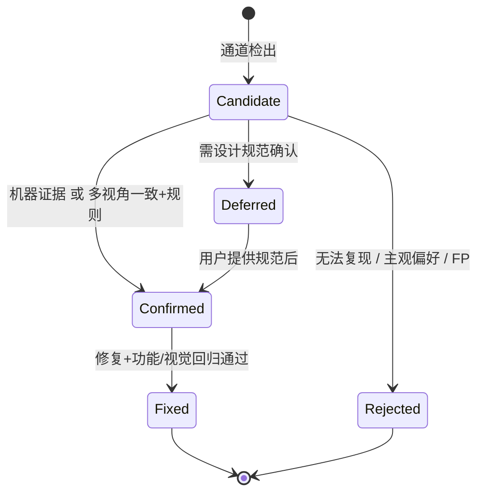

# 迭代式抓 BUG Skill 设计方案（全模态版）

> 目标：设计一个 MiMoCode skill，对任意代码库 / Web 应用 / 画布设计持续抓 BUG——覆盖**文字向**（代码逻辑、类型、安全）与**非文字向**（网页视觉、布局、可访问性、画布构图、交互状态），直到收敛——「在约定范围内没有新确认 BUG」为止。

**仓库定位（锁定）**：本仓库是 **skill 源码仓**。`DESIGN.md` 为设计真源；实现落地为根目录 `mmit-hunter/`（Phase 0 起创建）。设计若需降级归档，移至 `docs/DESIGN.md`，不在本阶段拆仓。

**SKILL.md 边界**：正文只保留触发条件、Scope 问答、主循环步骤、停止条件、输出模板指针。规则阈值、采集细节、脚本参数一律进 `references/` 与 `scripts/`，禁止把本 DESIGN 整篇塞进 SKILL.md。

---

## 1. 问题定义与设计目标

### 1.1 真正要解决的问题

用户说「帮我抓 BUG」时，常见 agent 的行为是：

1. 跑一遍 lint / typecheck / 测试，列出失败项，然后结束；
2. 只覆盖静态分析能看见的**表层文字问题**；
3. **完全看不见**「按钮被裁切、对比度不够、画布元素重叠、空状态没图、响应式断点炸了」这类**非文字 BUG**；
4. 没有「修完会不会引入新 bug」的再验证；
5. 没有「什么时候该停」的明确判据。

本 skill 要把「抓 BUG」升级为 **全模态闭环**：

```
代码文本  +  渲染截图  +  DOM/AX 树  +  画布场景图  +  交互轨迹
                ↓
        多模态感知与交叉验证
                ↓
     迭代到「约定范围内无新增确认 BUG」
```

### 1.2 设计目标

| 目标 | 含义 |
|------|------|
| **迭代到收敛** | 每轮扫描 → 确认 →（可选修复）→ 再验证，直到连续 N 轮无新增确认 BUG |
| **全模态多通道** | 代码通道 + **视觉/布局/可访问性/画布/交互**通道，轮换覆盖 |
| **跨模态可验证** | 视觉问题必须有截图证据；能用 DOM/AX/几何数据交叉验证的优先用机器证据压住纯主观审美 |
| **状态可恢复** | 进度、指纹、截图基线落盘，可 resume |
| **明确停止条件** | 收敛判据 + 预算护栏；收敛时声明盲区（含「未覆盖的视觉状态」） |

### 1.3 非目标

- 不做全自动无人值守的生产环境注入测试；
- 不替代专业视觉回归云服务（Percy/Chromatic）或无障碍合规认证；
- 不保证「数学意义零 BUG / 设计绝对正确」——收敛指**在约定策略、viewport、页面集合与预算下无新增确认项**。

### 1.4 全模态 BUG 分类（扩展 taxonomy）

**模态（modality）只有三值**——调度、指纹、统计一律用此枚举，避免 `a11y` 与 `web-visual` 双重计数：

| modality | 含义 |
|----------|------|
| `code` | 源码/测试/依赖，无需浏览器渲染 |
| `web-visual` | 需浏览器渲染或 DOM/AX/computed style 的一切问题（含无障碍） |
| `canvas` | 画布/海报/导出设计（scene JSON 或静态导出图） |

**category（子类）** 在 modality 之下细分；`ui-a11y` 归属 `web-visual`，不是独立 modality：

| modality | category | 示例 |
|----------|----------|------|
| **code** | crash / logic / security / perf / resource / contract | 空指针、鉴权绕过、泄漏 |
| **web-visual** | ui-layout | overflow / overlap / alignment / clipping |
| **web-visual** | ui-visual | contrast / font / missing-asset / placeholder |
| **web-visual** | ui-responsive | breakpoint / mobile-overflow / touch-target |
| **web-visual** | ui-a11y | name / role / focus / keyboard / aria / color-alone |
| **web-visual** | ui-ux-flow | empty-state / loading / error-toast / dead-end |
| **canvas** | canvas-design | safe-area / hierarchy / bleed / export-size |
| **canvas** | canvas-asset | resolution / aspect / watermark / color-space |
| **code** | test-gap | uncovered / weak-oracle / flaky |
| 任意 | meta | oracle-quality / false-positive pattern |

> 设计原则：**能机器判定的绝不留给主观**。对比度用 WCAG 公式；重叠用 bounding box；安全区用导出裁切框；审美只作「候选提出」，确认要靠可陈述规则。

---

## 2. 文献与开源生态调研

### 2.1 代码向（原有）

| 仓库 | Stars | 启发 |
|------|------:|------|
| [OpenHands/OpenHands](https://github.com/OpenHands/OpenHands) | 88k+ | 通用 agent 平台；工具化 ACI + 闭环 |
| [SWE-agent/SWE-agent](https://github.com/SWE-agent/SWE-agent) | 20k+ | Agent-Computer Interface 定制优于堆模型 |
| [SWE-agent/mini-swe-agent](https://github.com/SWE-agent/mini-swe-agent) | 7.7k+ | 极简 harness + 清晰协议即可高分 |
| [SWE-bench/SWE-bench](https://github.com/SWE-bench/SWE-bench) | 5.9k+ | 真实 issue + 可验证 oracle |
| [HypothesisWorks/hypothesis](https://github.com/HypothesisWorks/hypothesis) | 9k+ | Property-based testing |
| [stryker-mutator/stryker-js](https://github.com/stryker-mutator/stryker-js) | 3.1k+ | Mutation testing 测「测试是否抓得住」 |
| [iSEngLab/AwesomeLLM4APR](https://github.com/iSEngLab/AwesomeLLM4APR) | 246+ | LLM-APR 综述 taxonomy |
| [specula-org/Specula](https://github.com/specula-org/Specula) | — | 生成形式规格 + 自演化找深层 bug |

### 2.2 全模态 / 视觉向（新增）

| 仓库 / 工具 | Stars | 对本 skill 的启发 |
|------|------:|-------------------|
| [microsoft/playwright](https://github.com/microsoft/playwright) | 96k+ | **截图、多 viewport、AX tree、trace** 的标准采集层；MiMo 已有 playwright-mcp |
| [microsoft/Webwright](https://github.com/microsoft/Webwright) | 6k+ | SWE 风格 browser agent，长程 web 任务 SOTA |
| [dequelabs/axe-core](https://github.com/dequelabs/axe-core) | 7.5k+ | 无障碍规则引擎——**确定性 a11y oracle**，不靠 VLM 主观 |
| [americanexpress/jest-image-snapshot](https://github.com/americanexpress/jest-image-snapshot) | 3.9k+ | 像素 diff 基线；适合「改后是否视觉回归」 |
| [oblador/loki](https://github.com/oblador/loki) | 1.9k+ | Storybook 组件级视觉回归 |
| [reg-viz/reg-suit](https://github.com/reg-viz/reg-suit) | 1.3k+ | 视觉 diff 工作流与报告形态 |
| [cypress-visual-regression/…](https://github.com/cypress-visual-regression/cypress-visual-regression) | 661+ | E2E 内嵌视觉断言 |
| [happo/happo](https://github.com/happo/happo) | 514+ | 视觉 + 无障碍合一报告 |
| [mojoaxel/awesome-regression-testing](https://github.com/mojoaxel/awesome-regression-testing) | 2.4k+ | 视觉回归生态索引 |
| [WebPAI/ComUICoder](https://github.com/WebPAI/ComUICoder) | — | UI 不一致 = 语义分割 + element-wise feedback，可借「元素级对比」 |

### 2.3 关键论文（代码 + 全模态）

| 论文 | 核心结论 | 设计启示 |
|------|----------|----------|
| **SWE-agent** (NeurIPS 2024, arXiv:2405.15793) | ACI 设计显著影响 agent 行为 | 固定「怎么看代码 / 截图 / DOM」的动作序列 |
| **SWE-Test** (arXiv:2609.06229) | 反馈驱动修正；瓶颈是约束推断 | 每轮消费执行/渲染反馈 |
| **Specula** (arXiv:2607.25333) | 先生成规格再模型检验 | 无设计规范时，先推断「期望视觉不变量」再验 |
| **Agora** (arXiv:2605.29910) | 角色分离（假设/攻击/验证） | Detect 与 Confirm 用不同视角 |
| **kAgent** (arXiv:2504.20412) | 执行证据链 | 视觉 BUG 的证据 = 截图 + 盒模型/AX 数据 |
| **The Art of Repair** (arXiv:2505.02931) | 迭代优于一次多产出；会收益递减 | quiet_streak + 收益衰减护栏 |
| **ConVerTest** (arXiv:2602.10522) | 多数投票 + 双执行交叉验证 | VLM 审美评分需多视角一致才确认 |
| **SmellBench** (arXiv:2605.07001) | FP 可 >60%；激进修复引入新问题 | 视觉通道默认更严确认门 |
| **WebTestPilot** (arXiv:2602.11724) | GUI 元素符号化 + 前后置条件推断 oracle；P/R 约 96% | 把截图元素变成**变量**，用条件断言代替「看起来不对」 |
| **Trident / Seeing is Believing** (arXiv:2407.03037) | 三 agent（Explorer/Monitor/Detector）抓非 crash 功能 bug；Google Play 新发现 43 个 | 视觉线索可作 oracle；需要**页面序列**而非单帧 |
| **IWC-Bench** (arXiv:2609.15387) | 覆盖率引导探索 + 视觉/可用性/需求对齐三维评分 | 抓 UI bug 前先**探索可达状态**；评分与探索分离 |
| **ComUICoder** (arXiv:2602.19276) | 组件语义分割 + 元素级反馈减 UI 不一致 | 画布/页面按组件块对比，不要整页模糊比对 |
| **WinClick** (arXiv:2503.04730) | 纯截图 GUI grounding | 无 DOM 时（画布编辑器）靠视觉定位元素 |
| **CocoaBench** (arXiv:2604.11201) | 统一 agent 仍是 vision+code 联合短板 | 全模态任务要拆步，禁止一步「看图修所有」 |

### 2.4 综合洞察（升级）

```
有效「一直抓到没有」= 
    多策略轮换（找得到）           —— 含视觉/画布通道
  × 可执行 oracle（判得准）        —— 公式/AX/几何 优先，VLM 作补充
  × 跨模态证据链（说得出）         —— 截图 + DOM/AX + 复现步骤
  × 跨轮记忆（不重复）             —— 指纹含 viewport/route/canvas-id
  × 收敛判据（停得住）             —— 视觉基线稳定 + quiet_streak
  × 修复回归门（修不坏）           —— 像素/布局不回归
```

**视觉 oracle 优先级（高 → 低）：**

1. **确定性规则** — WCAG 对比度公式、bbox 相交、安全区裁切、触控目标尺寸（axe-core / 几何计算）
2. **符号化状态断言** — WebTestPilot 式：元素 → 变量，检查前置/后置条件
3. **基线像素 diff** — 与 golden 截图比（防回归，不直接当「新 bug 发现器」）
4. **多视角 VLM 一致** — ≥2 次独立审图一致才提候选（ConVerTest）
5. **纯主观审美** — 默认只进 Deferred，不进 Confirmed，除非用户提供设计规范

---

## 3. 核心概念模型

### 3.1 对象定义

| 对象 | 定义 | 落盘 |
|------|------|------|
| **Finding** | 某通道可疑问题，证据不足 | `findings/raw/*.json` |
| **Bug（确认）** | 经复现/交叉验证确认 | `bugs/confirmed/*.json` |
| **Rejected** | 假阳性 / 不可复现 | `bugs/rejected/*.json` |
| **Fixed** | 已修复且视觉/功能回归通过 | `bugs/fixed/*.json` |
| **Strategy** | 检测通道配方 | 内置 + `strategies/` |
| **Capture** | 一次采集产物（截图、DOM、AX、trace、canvas dump） | `runs/run-N/captures/` |
| **VisualBaseline** | 路由×viewport 的 golden 截图 | `.bug-hunter/baselines/` |
| **Run** | 一轮完整 SCAN→VERIFY | `runs/run-N/` |

### 3.2 全模态指纹

```
fingerprint = hash(
  modality +                       # code | web-visual | canvas  （仅此三值）
  normalize(route_or_file) +       # /login 或 src/date.ts 或 canvas#poster-01
  viewport_or_export_size +        # 375x812 | 1080x1920
  category +                       # ui-layout | ui-a11y | ...
  normalize(element_ref) +         # selector / canvas-object-id / symbol
  core_assertion_digest            # 「重叠」「对比度 2.8:1」等
)
```

同一视觉问题在不同 viewport 下**是不同 Finding**（因为修复可能只修一个断点）；同一 viewport 同一问题跨轮去重。

### 3.3 生命周期状态机（视觉扩展）



---

## 4. 总体架构

### 4.1 全模态系统图

```svg
<svg xmlns="http://www.w3.org/2000/svg" viewBox="0 0 680 580" font-family="-apple-system, 'PingFang SC', 'Microsoft YaHei', sans-serif">
  <defs>
    <marker id="arr" markerWidth="8" markerHeight="8" refX="6" refY="3" orient="auto">
      <path d="M0,0 L6,3 L0,6" fill="none" stroke="#334155" stroke-width="1"/>
    </marker>
  </defs>
  <rect x="0" y="0" width="680" height="580" fill="#f8fafc"/>
  <text x="340" y="26" text-anchor="middle" font-size="14" font-weight="500" fill="#0f172a">MMIT Hunter — 全模态闭环</text>

  <!-- Orchestrator -->
  <rect x="220" y="42" width="240" height="46" rx="8" fill="#e2e8f0" stroke="#334155" stroke-width="0.5"/>
  <text x="340" y="62" text-anchor="middle" font-size="13" fill="#0f172a">Orchestrator（state.json）</text>
  <text x="340" y="78" text-anchor="middle" font-size="11" fill="#475569">轮次 / 预算 / 指纹 / 收敛 / 策略调度</text>

  <!-- Capture layer -->
  <rect x="40" y="110" width="600" height="40" rx="8" fill="#e0f2fe" stroke="#0369a1" stroke-width="0.5"/>
  <text x="340" y="130" text-anchor="middle" dominant-baseline="central" font-size="12" fill="#0c4a6e">Capture 层：Playwright 截图 / 多 viewport / DOM+AX tree / trace · 画布 scene dump · 基线 diff</text>
  <line x1="340" y1="88" x2="340" y2="110" stroke="#334155" stroke-width="1" marker-end="url(#arr)"/>

  <!-- Code channels -->
  <rect x="40" y="175" width="145" height="72" rx="8" fill="#dbeafe" stroke="#1d4ed8" stroke-width="0.5"/>
  <text x="112" y="198" text-anchor="middle" font-size="12" fill="#1e3a8a">代码通道</text>
  <text x="112" y="216" text-anchor="middle" font-size="11" fill="#1e40af">static · dynamic</text>
  <text x="112" y="232" text-anchor="middle" font-size="11" fill="#1e40af">generate · structural</text>

  <!-- Visual channels -->
  <rect x="200" y="175" width="145" height="72" rx="8" fill="#fce7f3" stroke="#be185d" stroke-width="0.5"/>
  <text x="272" y="198" text-anchor="middle" font-size="12" fill="#9d174d">视觉布局</text>
  <text x="272" y="216" text-anchor="middle" font-size="11" fill="#be185d">overflow / overlap</text>
  <text x="272" y="232" text-anchor="middle" font-size="11" fill="#be185d">alignment / spacing</text>

  <!-- A11y / responsive -->
  <rect x="360" y="175" width="145" height="72" rx="8" fill="#fef3c7" stroke="#b45309" stroke-width="0.5"/>
  <text x="432" y="198" text-anchor="middle" font-size="12" fill="#78350f">A11y / 响应式</text>
  <text x="432" y="216" text-anchor="middle" font-size="11" fill="#92400e">axe · contrast · focus</text>
  <text x="432" y="232" text-anchor="middle" font-size="11" fill="#92400e">breakpoint · touch</text>

  <!-- Canvas -->
  <rect x="520" y="175" width="120" height="72" rx="8" fill="#ede9fe" stroke="#6d28d9" stroke-width="0.5"/>
  <text x="580" y="198" text-anchor="middle" font-size="12" fill="#4c1d95">画布设计</text>
  <text x="580" y="216" text-anchor="middle" font-size="11" fill="#5b21b6">safe-area</text>
  <text x="580" y="232" text-anchor="middle" font-size="11" fill="#5b21b6">hierarchy · export</text>

  <line x1="200" y1="150" x2="112" y2="175" stroke="#334155" stroke-width="1" marker-end="url(#arr)"/>
  <line x1="300" y1="150" x2="272" y2="175" stroke="#334155" stroke-width="1" marker-end="url(#arr)"/>
  <line x1="400" y1="150" x2="432" y2="175" stroke="#334155" stroke-width="1" marker-end="url(#arr)"/>
  <line x1="500" y1="150" x2="580" y2="175" stroke="#334155" stroke-width="1" marker-end="url(#arr)"/>

  <!-- funnel -->
  <rect x="180" y="280" width="320" height="40" rx="8" fill="#fef3c7" stroke="#b45309" stroke-width="0.5"/>
  <text x="340" y="300" text-anchor="middle" dominant-baseline="central" font-size="12" fill="#78350f">全模态指纹去重 → Findings 池</text>
  <line x1="112" y1="247" x2="250" y2="280" stroke="#334155" stroke-width="1" marker-end="url(#arr)"/>
  <line x1="272" y1="247" x2="300" y2="280" stroke="#334155" stroke-width="1" marker-end="url(#arr)"/>
  <line x1="432" y1="247" x2="380" y2="280" stroke="#334155" stroke-width="1" marker-end="url(#arr)"/>
  <line x1="580" y1="247" x2="430" y2="280" stroke="#334155" stroke-width="1" marker-end="url(#arr)"/>

  <!-- confirm with cross-modal -->
  <rect x="120" y="355" width="200" height="56" rx="8" fill="#dcfce7" stroke="#15803d" stroke-width="0.5"/>
  <text x="220" y="378" text-anchor="middle" font-size="12" fill="#14532d">跨模态 Confirm</text>
  <text x="220" y="396" text-anchor="middle" font-size="11" fill="#166534">规则优先 + 多视角一致</text>

  <rect x="360" y="355" width="200" height="56" rx="8" fill="#fee2e2" stroke="#b91c1c" stroke-width="0.5"/>
  <text x="460" y="378" text-anchor="middle" font-size="12" fill="#7f1d1d">Reject / Deferred</text>
  <text x="460" y="396" text-anchor="middle" font-size="11" fill="#991b1b">FP / 主观偏好 / 待规范</text>

  <line x1="280" y1="320" x2="220" y2="355" stroke="#334155" stroke-width="1" marker-end="url(#arr)"/>
  <line x1="400" y1="320" x2="460" y2="355" stroke="#334155" stroke-width="1" marker-end="url(#arr)"/>

  <!-- fix + visual regression -->
  <rect x="120" y="440" width="200" height="52" rx="8" fill="#e0e7ff" stroke="#4338ca" stroke-width="0.5"/>
  <text x="220" y="462" text-anchor="middle" font-size="12" fill="#312e81">Fix Gate</text>
  <text x="220" y="478" text-anchor="middle" font-size="11" fill="#3730a3">修 + 功能/视觉回归门</text>
  <line x1="220" y1="411" x2="220" y2="440" stroke="#334155" stroke-width="1" marker-end="url(#arr)"/>

  <rect x="360" y="440" width="200" height="52" rx="8" fill="#f1f5f9" stroke="#0f172a" stroke-width="0.5"/>
  <text x="460" y="462" text-anchor="middle" font-size="12" fill="#0f172a">Converge?</text>
  <text x="460" y="478" text-anchor="middle" font-size="11" fill="#475569">K 轮无新增 + 基线稳定</text>
  <line x1="320" y1="466" x2="360" y2="466" stroke="#334155" stroke-width="1" marker-end="url(#arr)"/>

  <!-- loop -->
  <path d="M560 466 Q620 466 620 280 Q620 130 500 100" fill="none" stroke="#64748b" stroke-width="1" stroke-dasharray="4 3" marker-end="url(#arr)"/>
  <text x="640" y="300" text-anchor="middle" font-size="11" fill="#64748b">未收敛</text>
  <text x="640" y="316" text-anchor="middle" font-size="11" fill="#64748b">换通道</text>

  <text x="340" y="545" text-anchor="middle" font-size="11" fill="#64748b">证据包：截图 + bbox/DOM/AX 摘要 + 复现步骤 · 全部落盘 .bug-hunter/</text>
</svg>
```

> **图例**：中间四个色块是**策略组**，不是 modality。modality 仅三值：`code`（左）/ `web-visual`（中三组皆属之，含 A11y）/ `canvas`（右）。调度、指纹、统计一律用三值 modality；组仅决定本轮跑哪些 rule_id。

### 4.2 目录与状态落盘

```
.bug-hunter/
├── state.json
├── fingerprints.json
├── baselines/                    # 视觉 golden 截图
│   └── web/
│       └── home__375x812.png
├── captures/                     # 本轮采集（可清理，基线单独保留）
├── runs/
│   └── run-N/
│       ├── plan.md
│       ├── captures/             # screenshots, ax.json, dom-snippets, canvas-dump.json
│       ├── findings/
│       ├── verify.md
│       └── summary.md
├── bugs/
│   ├── confirmed/                # 每条 bug 可附 evidence/ 截图
│   ├── fixed/
│   ├── rejected/
│   └── deferred/
└── REPORT.md
```

`state.json` 增补字段：

```json
{
  "modalities_enabled": ["code", "web-visual"],
  "surfaces": {
    "web": {
      "base_url": "http://127.0.0.1:3000",
      "routes": ["/", "/login", "/dashboard"],
      "viewports": ["375x812", "1440x900"],
      "auth": {"mode": "storage_state", "file": ".bug-hunter/auth.json"},
      "degrade_level": "auto"
    },
    "canvas": {
      "kind": "scene-json",
      "items": [
        {
          "id": "poster-hero",
          "export_size": "1080x1920",
          "source": ".bug-hunter/canvas/poster-hero.json",
          "render_png": ".bug-hunter/canvas/poster-hero.png",
          "spec": { "safe_inset_pct": 5 }
        }
      ]
    }
  },
  "visual_oracle": {
    "min_contrast": 4.5,
    "touch_target_px": 44,
    "allow_subjective": false,
    "fp_downweight_threshold": 0.7,
    "fp_calibration_runs": 1
  },
  "budget": { "max_runs": 20, "max_captures_per_run": 80 },
  "convergence": { "quiet_streak": 0, "required_quiet_streak": 2 },
  "concurrency": { "writer": "main-agent-only", "lock_file": ".bug-hunter/.lock" }
}
```

---

## 5. 检测通道（Strategy Bank）— 全模态版

### 5.1 通道总表

| ID | modality | 动作 | Oracle | 成本 |
|----|----------|------|--------|------|
| `static` | code | typecheck / lint / 安全扫描 | 工具退出码 | 低 |
| `dynamic` | code | 跑测试、复现失败栈 | 测试断言 | 中 |
| `generate` | code | 边界用例 / property 测试 | 新测试红且原因真实 | 高 |
| `structural` | code | 复杂度热点、未处理错误路径 | 可构造复现 | 中 |
| `speculative` | code | 并发、超大输入、权限边界 | 最小复现脚本 | 高 |
| `meta-test` | code | 覆盖率空洞、mutation、flaky | mutation kill / 复现 | 高 |
| **`capture-baseline`** | web-visual | 启动页/组件，多 viewport 截图 + DOM/AX 快照 | 采集成功 | 低 |
| **`layout-geom`** | web-visual | 读 bounding box：overflow、overlap、zero-size、off-canvas | **几何规则**（确定性） | 中 |
| **`visual-diff`** | web-visual | 与 baseline 像素/结构 diff；无基线则建基线 | diff 阈值 + 区域标注 | 中 |
| **`a11y-axe`** | web-visual | Playwright + axe-core 全规则 | **axe 违规**（确定性） | 低 |
| **`contrast-type`** | web-visual | 抽 computed style：对比度、字号、行高、touch target | WCAG 公式 | 低 |
| **`responsive-matrix`** | web-visual | 对 routes×viewports 矩阵重复 layout-geom | 几何规则 | 中 |
| **`ux-flow`** | web-visual | 空状态、loading、错误 toast、成功反馈、死链 | 符号化状态断言 | 高 |
| **`canvas-safe`** | canvas | 场景 JSON/导出图：安全区、出血、层级 z、导出尺寸 | 画布几何/元数据规则 | 中 |
| **`canvas-asset`** | canvas | 分辨率、宽高比、色彩模式、重复资源 | 资源元数据 | 低 |
| **`vlm-audit`** | web-visual / canvas | 多视角 VLM 审图，仅产出候选 | ≥2 视角一致 + 规则不冲突 | 高 |

### 5.2 采集协议（Capture Protocol）

视觉通道的输入质量决定上限。固定协议：

1. **环境**：优先 Playwright（或 playwright-mcp）；dev server 由用户启动或 skill 请求启动并记录 URL。
2. **路由集**：`state.surfaces.web.routes`；默认先爬关键链接补全，上限 N 条，避免爆炸。
3. **Viewport 矩阵**：至少 `375x812`、`1440x900`；有平板再加 `768x1024`。
4. **每页产物**：
   - `full.png`（全页）+ `viewport.png`（首屏）
   - `elements.json`：关键节点 selector、bbox、text、computed styles（字号/颜色/overflow）
   - `ax.json`：Accessibility tree（Playwright `page.accessibility.snapshot`）
   - `console.json`：error/warning
5. **稳定化**：等待 network idle / 显式 `waitFor`；禁动画（`prefers-reduced-motion`）避免假 diff。
6. **认证**：`storage_state` 文件；截图不得进入未授权页面。
7. **画布（统一 `kind`，三种来源映射到同一 item 结构）**：

| 来源 kind | 如何变成统一 item |
|-----------|-------------------|
| `scene-json` | 直接读对象列表：`id, x,y,w,h,zIndex, export_box, assets[]` |
| `html-canvas-app` | 由页面脚本/调试接口 dump 场景为 `scene-json`，再走同一路径；无 dump 则降级为「整图导出 + 归一化坐标」 |
| `figma-export` | 仅接受用户提供的 PNG/JSON 导出；无 API 则 `canvas-safe` 只跑导出尺寸/安全区，`z-order-occlusion` 标为 unavailable |

统一 item 必填：`id`, `export_size`, `source`；可选：`render_png`, `spec.safe_inset_pct`。

产物路径写入 `runs/run-N/captures/MANIFEST.json`，供 Confirm 引用。

### 5.2b 并发与状态写入

- **单写者**：只有 **main agent** 可写 `state.json` / `fingerprints.json` / `bugs/**`；
- **subagent** 只允许：采集截图/AX → 写 `runs/run-N/captures/`、跑只读 probe → 写 `runs/run-N/findings/raw/`；
- 每次写 `state.json` 前创建/持有 `.bug-hunter/.lock`（`O_EXCL` 或 `os.O_CREAT|os.O_EXCL`）；拿到锁才读改写，失败则等待重试（上限 3 次）后报错中止本轮，禁止无锁覆盖；
- 禁止并行两个会话同时对同一项目跑 skill；后启动者见 lock 存在则直接失败并提示。

### 5.3 视觉/画布规则库（确定性优先）

**布局（layout-geom）**

| 规则 ID | 判定 | 默认阈值 |
|---------|------|----------|
| `overflow-x` | `scrollWidth > clientWidth + ε` 于页面根 | ε=2px |
| `text-clip` | 文本节点 `scrollWidth > clientWidth` 且非设计截断 | 需排除 `ellipsis` 设计 |
| `overlap-interactive` | 两可点击元素 bbox 相交面积 > 20% | |
| `zero-size` | 有内容节点 w/h < 1 | |
| `off-canvas` | bbox 完全在 viewport 外且非 lazy | |
| `touch-target` | 可点击区域 min(w,h) < 44px | 移动 viewport |

**对比度 / 排版（contrast-type）**

| 规则 ID | 判定 |
|---------|------|
| `contrast-text` | 前景/背景相对亮度对比 < 4.5:1（大字 3:1） |
| `font-too-small` | 计算字号 < 12px（可配置） |
| `line-height-tight` | 行高/字号 < 1.2 且多行 |

**无障碍（a11y-axe）**：直接映射 axe 规则 ID（`image-alt`、`button-name`、`link-name`、`color-contrast`、`label`、`aria-*`…），违规即 Finding。

**响应式（responsive-matrix）**：同一逻辑元素在更窄 viewport 出现新的 `overflow-x` / `overlap` → 独立 Finding（指纹含 viewport）。

**画布（canvas-safe / canvas-asset）**

| 规则 ID | 判定 |
|---------|------|
| `safe-area-violation` | 内容超出用户给定安全区（默认各边 5%） |
| `bleed-insufficient` | 印刷导出出血 < 规范（若有） |
| `export-mismatch` | 导出尺寸 ≠ 目标尺寸 |
| `z-order-occlusion` | 文字/主体被完全遮挡（bbox + 简单不透明度启发式） |
| `low-res-asset` | 位图显示尺寸 > 2× 有效分辨率 |
| `aspect-distort` | 图片/元素宽高比被非等比拉伸 > 2% |
| `hierarchy-flat` | 主 CTA 与背景对比/面积比低于次级元素（启发式，进 Deferred 优先） |

### 5.4 策略调度（含模态轮换）

```
每轮：
  1. 探测 surfaces 可达性 → 写 degrade_level（见下）
  2. 仅在「已启用且当前 degrade 允许」的通道中选策略集：
     - 首轮：static + dynamic +（若 L≥2）capture-baseline + a11y-axe + layout-geom
     - 之后：cursor 轮换；优先上轮有新发现的模态
     - quiet_streak≥1：加压 responsive-matrix / ux-flow / canvas-safe / vlm-audit
  3. 禁止连续两轮完全相同策略集
  4. 某模态不可用 → 降级，不假装扫过；记入 Blind Spots
```

**降级阶梯（Degrade Ladder）— 每轮开始写入 `state.surfaces.web.degrade_level`**

| 级别 | 条件 | 允许通道 | 行为 |
|------|------|----------|------|
| **L0** | 无法确定项目类型 / 无任何可执行工具 | 无 | 立即停，报告「无法开工」，不进入循环 |
| **L1** | 有源码，无浏览器/dev server | `static` `dynamic` `generate` `structural` `meta-test` | 纯 code 迭代；Blind Spots 写「无 web-visual / canvas」 |
| **L2** | 有 dev server 或 file:// 可开页；无 axe 依赖可装 | L1 + `capture-baseline` `layout-geom` `contrast-type` `responsive-matrix` | 用几何/computed style；跳过 axe |
| **L3** | L2 + axe-core 可用（依赖或 npx） | L2 + `a11y-axe` | 默认 web 全开 |
| **L4** | L3 + 有 canvas 场景/导出图 + 规范 | L3 + `canvas-safe` `canvas-asset` `vlm-audit` `ux-flow` | 全模态 |

规则：**只升不隐式降**——中途探测失败可在本轮降级，但必须在 `run-N/summary.md` 与最终 REPORT 的 Blind Spots 写明；禁止静默跳过。

### 5.5 跨模态 Confirm Protocol

Detect 与 Confirm 视角分离（Agora）。视觉 Finding **最低证据**：

| 证据等级 | 内容 | 可直接 Confirmed？ |
|----------|------|-------------------|
| L0 | VLM「感觉不好看」 | 否 → Deferred 或 Reject |
| L1 | 截图 + 文字描述 | 否，除非可复现步骤 |
| L2 | 截图 + 元素 selector/bbox + 复现（route+viewport） | 视规则而定 |
| L3 | L2 + 机器规则命中（axe id / 对比度数值 / 相交面积） | **是** |
| L4 | L3 + 用户提供规范条文 | **是**（优先） |

**确认清单（视觉版，全部满足）：**

1. 可定位：route/canvas item + selector 或归一化坐标 + viewport  
2. 可陈述：期望 vs 实际（有数用数：对比度 2.8:1、重叠 36%、overflow 12px）  
3. 可证据：L3/L4；纯审美必须 L4 规范  
4. 指纹未重复  
5. category ∈ §1.4  

**拒绝时**：写明「规则误报 / 设计意图截断 / 动画瞬态 / 未登录页 / 主观」等。

**VLM 审图协议（仅候选）：**

- 同一截图独立跑 2 次（可不同 prompt 侧重：布局 / 信息层级 / 空状态）；
- 两次都点名同一问题且位置描述一致 → 才进 Candidate；
- 与 `layout-geom`/`a11y-axe` 结果交叉：机器已报同类则合并证据升级，不重复计数。

### 5.6 WebTestPilot 式符号化（进阶，Phase 2）

把关键控件变成符号，用前后置条件代替纯看图：

```
symbols: [submitBtn, toast, errorBanner, formValid]
step: click(submitBtn) with empty form
pre: formValid == false
post: errorBanner.visible && toast.hidden
```

由 agent 从页面文案/常见模式**推断**条件，推断结果写入 `verify.md` 供用户校对——推断本身可错，所以标 `inferred-oracle: true`。

---

## 6. 迭代主循环

### 6.1 伪代码（全模态）

```
while not converged and budget_ok:
    degrade = probe_surfaces(state)          # L0–L4，写回 state
    if degrade == L0: report_and_exit()
    plan = select_strategies(state, degrade) # 含模态轮换；禁连两轮同集
    captures = run_capture_layer(plan)       # L1 时为空
    raw = execute_strategies(plan, captures)
    findings = fingerprint_dedupe(raw, state.fingerprints)
    for f in findings:
        verdict = cross_modal_confirm(f)     # §5.5
        persist(verdict, evidence_paths)     # 主 agent 单写 + lock
    if mode == "hunt-and-fix":
        for bug in pick_highest_value(confirmed):
            patch = propose_fix(bug)
            if regression_gate(patch):       # §6.3 可判定门
                persist_fixed(bug, patch)
                if intentional_visual_change:
                    update_baseline(bug.route, bug.viewport)
                    mark_verify_intentional()
            else:
                rollback()
    update_convergence(state)                # §6.2 四条件
    write_run_summary()
write_final_report()  # Blind Spots 必含降级与未扫矩阵
```

### 6.2 收敛判据（含视觉）

```
converged ⇔ quiet_streak ≥ K
  quiet(本轮) 必须同时满足：
    1. 执行了 ≥1 条「当前 degrade_level 允许」的策略；
    2. 该策略集覆盖了 modalities_enabled 中每一个仍可用的 modality
       （例如 L3 下本轮不能只跑 static 就算 quiet）；
    3. 新 Confirmed == 0；
    4. 未引入新回归（功能测试失败 / 视觉 diff 超阈 / 新 axe 违规）。
  默认 K = 2；quiet_streak 在违反任一条时清零。
```

**视觉附加条件（若 degrade ≥ L2）：**

- 本轮对「已扫过」的 route×viewport 未出现新的 L3 级 Finding；
- 若用户要求「视觉也要稳」，可加：连续两轮 `visual-diff` 无意外变更。

**FP 降权（可配置，非写死 70%）：**

- 阈值读 `state.visual_oracle.fp_downweight_threshold`（默认 0.7）；
- **首轮校准**：`fp_calibration_runs`（默认 1）内只统计不降权，结束后把实际 FP 率写入 `state.stats`，若观测 FP 持续 > 阈值则降权并记入报告；
- 降权动作：该通道权重 ×0.5 或暂时移出轮换，直至用户重置或 FP 回落。

**其他护栏**：`max_runs` / 墙钟时间 / `max_fix_failures`。

### 6.3 Fix Gate（视觉版）

1. 只修 Confirmed；Deferred 需用户点头；  
2. 一次一修；  
3. **回归门（可判定，禁止「可解释」这种主观词）**：
   - 目标症状消失（同一 `rule_id` 在同 route×viewport 不再命中）；
   - 原绿测试仍绿；
   - 同轮对**回归矩阵**（默认全部已扫 route × 已扫 viewport）重跑 `layout-geom` + `a11y-axe`，**零新增**违规；
   - 像素 diff：仅比较「修改影响的路由 × viewport」；非目标页面若 diff，**默认 fail**；仅当变更同时更新了 `baselines/` 且在 `run-N/verify.md` 写明「有意视觉变更 + 原因」才可放行（机器可查：baseline 文件 mtime 晚于补丁 + verify 含标记字段 `intentional_visual_change: true`）；
4. 失败 → `git checkout` / 原像回滚，记 `fix-failed`；连续同一 bug 失败 ≥ `max_fix_failures` 则改 Deferred。

---

## 7. 与 MiMoCode 能力的映射

### 7.1 Skill 目录（与仓库定位一致）

```
MiMo Multimodal Iterative Testing/          # 本仓库根
├── DESIGN.md                       # 本文（实现后可迁 docs/DESIGN.md）
├── docs/
│   ├── ACCEPTANCE.md               # Phase 0 验收项目与 DoD 勾选
│   └── METRICS.md                  # 各项目观测指标（§11）
└── mmit-hunter/           # skill 本体
    ├── SKILL.md
    ├── references/
    │   ├── strategies.md            # 全部通道配方
    │   ├── capture-protocol.md      # 截图/DOM/AX/画布采集
    │   ├── visual-rules.md          # §5.3 规则阈值与例外
    │   ├── confirm-protocol.md
    │   ├── fix-gate.md              # §6.3 可判定回归门
    │   ├── report-template.md
    │   └── paper-notes.md
    ├── scripts/
    │   ├── init_state.py
    │   ├── fingerprint.py
    │   ├── converge_check.py        # 实现 §6.2 quiet 四条件
    │   ├── capture_web.py           # Playwright：多 viewport 截图+AX
    │   ├── layout_probe.py
    │   ├── contrast_probe.py
    │   └── validate_report.py
    └── locales/
        ├── zh-CN.json
        └── en-US.json
```

### 7.2 Frontmatter 草案

```yaml
---
name: mmit-hunter
description: >
  全模态迭代抓 BUG 直到收敛：代码通道（静态/动态/生成式）+ 视觉通道
  （布局几何、对比度、axe 无障碍、响应式矩阵、UX 状态）+ 画布通道
  （安全区/导出/层级/资源），指纹去重、跨模态确认、可选修复+回归门。
  Use when: 抓BUG / 找bug / 修到没有 / bug hunt / hunt until clean /
  网页视觉问题 / 布局炸了 / 无障碍 / 画布设计检查 / UI不对 / 对比度 /
  响应式问题 / design QA / visual bug。
  Do NOT use for one-shot lint 汇总, pure feature dev, or when no
  runnable app/assets and user only wants static code review.
---
```

**SKILL.md 正文必含（实现清单，细节不在此展开）**

1. 触发与 Scope 问答（mode / routes / viewports / canvas）
2. 降级阶梯 L0–L4 摘要（指向 `references/strategies.md`）
3. 主循环步骤号（对齐 §6.1）
4. quiet 四条件 + K（对齐 §6.2）
5. 确认门 L3/L4（对齐 §5.5）
6. 用户合同（附录 B）
7. 禁止：双会话同项目、无锁写 state、把本文塞进 SKILL.md

### 7.3 本机工具绑定

| 能力 | 工具 |
|------|------|
| 打开页面、点选、截图、快照 | **playwright-mcp**（已配置） |
| 读图、目视检查 | agent 视觉输入 + `read` 图片 |
| 跑 axe / 几何脚本 | `bash` + `MIMO_PYTHON` |
| 并行多路由采集 | `actor` subagent |
| 定时再巡检 | `loop` / `cron` |
| 画布图生成对比稿 | `image_gen`（仅作参考，不当 oracle） |

### 7.4 主流程步骤（SKILL.md）

1. **Scope**：code-only 还是 code+web+canvas；routes/viewports；mode；预算。  
2. **Bootstrap**：`init_state.py`；探测 dev server / 画布资源。  
3. **Capture**：`capture_web.py` 或 playwright-mcp；建 baseline。  
4. **Loop**：§6；每轮 `task` 登记。  
5. **Confirm**：跨模态证据包。  
6. **Fix（可选）** + 视觉回归门。  
7. **Converge / Guardrail**。  
8. **Report**：含截图相对路径、规则 ID、盲区。

---

## 8. 记录与报告

### 8.1 视觉 Bug JSON 示例

```json
{
  "id": "bug-0012",
  "fingerprint": "d4e5f6…",
  "status": "confirmed",
  "modality": "web-visual",
  "category": "ui-layout",
  "severity": "high",
  "title": "登录页主按钮在 375px 下被裁切",
  "location": {
    "surface": "web",
    "route": "/login",
    "viewport": "375x812",
    "selector": "[data-testid=submit]",
    "bbox": {"x": 340, "y": 620, "w": 120, "h": 48}
  },
  "statement": "期望按钮完整可见可点；实际右缘超出视口 18px，overflow-x 存在",
  "evidence": {
    "level": "L3",
    "screenshot": "runs/run-3/captures/login__375x812__viewport.png",
    "rule_id": "overflow-x",
    "metrics": {"overflow_px": 18},
    "repro": "打开 /login @375x812，观察提交按钮右缘"
  },
  "detected_by": "layout-geom",
  "run_id": "run-3",
  "fix": null
}
```

### 8.2 REPORT.md 必含

1. 范围：surfaces、routes、viewports、K、轮数  
2. 执行摘要：按 modality 分列 confirmed/fixed/rejected/deferred  
3. 确认清单（code 与 visual/canvas 分节，附截图路径与规则 ID）  
4. 已修复与回归（含是否更新 baseline）  
5. 拒绝样本（校准信任，尤其是 VLM 候选被拒原因）  
6. **已知盲区**：未启动的服务、未扫 viewport、无设计规范的 Deferred、画布未覆盖场景  
7. 建议：CI 接入 axe、视觉 baseline、mutation、补测

---

## 9. 风险与缓解

| 风险 | 表现 | 缓解 |
|------|------|------|
| 视觉假阳性 | 「不好看」刷屏 | L3 证据门槛；纯审美进 Deferred；FP 降权 |
| 动画/字体导致假 diff | 每轮都「新变化」 | 禁动画、系统字体稳定、diff 区域白名单 |
| 采集不稳 | 截图时序随机 | network idle + 显式 wait + 重试一致才入库 |
| 画布无 DOM | 无法 selector | 场景 JSON 对象 id；无则归一化坐标 + 导出图 |
| 修复引入布局回归 | 修 A 炸 B | 响应式矩阵回归门 + 非目标 diff |
| 权限/登录 | 截到登录墙当 bug | storage_state；未授权页跳过并记盲区 |
| VLM 幻觉 | 虚构元素 | 与 elements.json 交叉；框外元素一律 Reject |
| 预算爆炸 | 全站×全 viewport | 路由上限、viewport 子集、优先核心流 |
| 破坏性操作 | 乱改生产 | 默认本地/dev；修复前确认；不碰真实用户数据 |

---

## 10. 分阶段落地

### 10.1 Phase 0 — 骨架 + 验收 DoD（必须先过）

**交付物**

- `mmit-hunter/SKILL.md`（主循环，≤5000 词）
- `scripts/`: `init_state.py`, `fingerprint.py`, `converge_check.py`
- 通道：`static` `dynamic` + degrade≥L2 时的 `a11y-axe` + `overflow-x`（`layout-geom` 最小集）
- `references/report-template.md` + 能写出 `REPORT.md`

**验收项目（锁定一个，写入本仓库 `docs/ACCEPTANCE.md`）**

- 必须：本地可启动的 web demo（建议：Vite/React 或 Next 官方示例，含至少 2 条路由）
- 必须：可注入或天然存在 **≥1 个 L3 级视觉 bug**（如按钮在 375px 下 overflow）与 **≥1 个静态/测试问题**
- 禁止：用「空仓库 / 纯 markdown」验收

**Phase 0 DoD（全部满足才算完成）**

| # | 检查项 | 通过标准 |
|---|--------|----------|
| 1 | 可 resume | 删掉会话再跑，读 `state.json` 能接着 quiet_streak |
| 2 | 迭代收敛 | 在验收项目上跑满 ≤4 轮，满足 §6.2 quiet 定义后停止 |
| 3 | L3 视觉 Finding | 至少 1 条 `category` 含 `ui-*`，evidence.level=L3，含截图路径 |
| 4 | 假阳性 | Confirmed 中无法复现/无 L3 证据的条数 = 0 |
| 5 | 去重 | 第 2 轮起「新 Finding 中已见指纹」占比可统计，且不重复写入 confirmed |
| 6 | REPORT | 含范围、按 modality 摘要、Blind Spots、规则 ID |
| 7 | 降级演示 | 人为去掉 dev server，degrade→L1，报告 Blind Spots 含 web-visual |
| 8 | 无锁冲突 | 故意双写测试下，第二写者失败提示，不出现损坏的 state.json |

### 10.2 Phase 1 — 全模态成型
- `capture_web.py` 多 viewport + elements.json  
- 完整 `layout-geom` + `contrast-type` + `responsive-matrix`  
- 基线 visual-diff 与 Fix Gate 视觉回归（§6.3 可判定版）  
- hunt-and-fix + 回归矩阵  

### 10.3 Phase 2 — 深层与画布
- `ux-flow` + WebTestPilot 符号化  
- 统一 item 结构下的 `canvas-safe` / `canvas-asset`  
- `vlm-audit` 双视角候选  
- subagent 并行采集（遵守 §5.2b 单写者）  

### 10.4 Phase 3 — 工程化
- CI：axe 门禁 + baseline 锁  
- 路由自动发现与优先级  
- 误报模式反哺 AGENTS.md / 规则白名单  
- 导出 machine-readable JSON  
- 用 `docs/ACCEPTANCE.md` 外的第二项目做回归验收  

---

## 11. 成功度量

> **阶段说明**：Phase 0/1 无历史数据，下表是**目标带宽，不是承诺**。每完成一个验收项目，把观测值记入 `docs/METRICS.md`；连续 3 个项目未落入带宽则回改规则/阈值，而不是只调文档措辞。

| 指标 | 目标带宽 | 采集方式 |
|------|----------|----------|
| 代码确认率 | ≥ 40% | confirmed / (confirmed+rejected) |
| 视觉 L3 确认率 | ≥ 50% | 同上，modality=web-visual 且 L3 |
| VLM 候选→Confirmed | 10%–30% | vlm-audit 进入 confirmed 的比例 |
| 收敛轮数（L3 全模态） | 3–8 轮 | state.run_count |
| 修复回归率 | ≥ 80% | fixed 且无 fix-failed / 无新违规 |
| 跨轮视觉重复 Finding | 第 3 轮起 →0 | fingerprints 命中率 |
| Phase 0 DoD | 8/8 | §10.1 表 |

---

## 12. 参考文献

### 代码 / 工具
1. OpenHands — https://github.com/OpenHands/OpenHands  
2. SWE-agent — https://github.com/SWE-agent/SWE-agent  
3. mini-swe-agent — https://github.com/SWE-agent/mini-swe-agent  
4. SWE-bench — https://github.com/SWE-bench/SWE-bench  
5. Hypothesis — https://github.com/HypothesisWorks/hypothesis  
6. Stryker — https://github.com/stryker-mutator/stryker-js  
7. AwesomeLLM4APR — https://github.com/iSEngLab/AwesomeLLM4APR  
8. Specula — https://github.com/specula-org/Specula  
9. **Playwright** — https://github.com/microsoft/playwright  
10. **Webwright** — https://github.com/microsoft/Webwright  
11. **axe-core** — https://github.com/dequelabs/axe-core  
12. **jest-image-snapshot** — https://github.com/americanexpress/jest-image-snapshot  
13. **loki** — https://github.com/oblador/loki  
14. **reg-suit** — https://github.com/reg-viz/reg-suit  
15. **cypress-visual-regression** — https://github.com/cypress-visual-regression/cypress-visual-regression  
16. **happo** — https://github.com/happo/happo  
17. **awesome-regression-testing** — https://github.com/mojoaxel/awesome-regression-testing  
18. **ComUICoder** — https://github.com/WebPAI/ComUICoder  

### 论文
1. Yang et al. SWE-agent. NeurIPS 2024. arXiv:2405.15793  
2. Shi et al. SWE-Test. arXiv:2609.06229  
3. Cheng et al. Specula. arXiv:2607.25333  
4. Liu et al. Agora. arXiv:2605.29910  
5. Mathai et al. kAgent. arXiv:2504.20412  
6. Ruiz et al. The Art of Repair. EASE 2025. arXiv:2505.02931  
7. Taherkhani et al. ConVerTest. arXiv:2602.10522  
8. Shepard et al. Probe-and-Refine. arXiv:2606.20512  
9. Rawat. NeuroLog. arXiv:2606.00669  
10. Dinu et al. SmellBench. arXiv:2605.07001  
11. Liu et al. Coding Agents Have Converged. arXiv:2609.17394  
12. **Teoh et al. WebTestPilot. arXiv:2602.11724**  
13. **Liu et al. Trident / Seeing is Believing. arXiv:2407.03037**  
14. **Liu et al. IWC-Bench. arXiv:2609.15387**  
15. **Xiao et al. ComUICoder. arXiv:2602.19276**  
16. **Hui et al. WinClick. arXiv:2503.04730**  
17. **Hao et al. CocoaBench. arXiv:2604.11201**  
18. **Zhou et al. ENVS / OSWorld-Noisy. arXiv:2606.22948**  

---

## 附录 A：默认参数速查

| 参数 | 默认 | 说明 |
|------|------|------|
| `mode` | `hunt-and-fix` | 可改 `hunt-only` |
| `required_quiet_streak` (K) | 2 | 连续安静轮；quiet 定义见 §6.2 |
| `modalities_enabled` | `[code, web-visual]` | canvas 有资产时再加入 |
| `max_runs` | 20 | |
| `max_wall_minutes` | 180 | |
| `viewports` | 375x812, 1440x900 | 指纹区分 viewport |
| `min_contrast` | 4.5:1（大字 3:1） | |
| `touch_target_px` | 44 | |
| `overflow_epsilon_px` | 2 | |
| `vlm_min_agreement` | 2 | 仅候选，不直接 Confirmed |
| `allow_subjective` | false | 纯审美 → Deferred |
| `fp_downweight_threshold` | 0.7 | 可配置；先校验后降权 |
| `fp_calibration_runs` | 1 | 首轮只统计 |
| `min_severity_for_fix` | medium | low 只报告 |
| `max_fixes_per_run` | 5 | |
| `max_fix_failures` | 5 | 同一 bug |
| `concurrency.writer` | `main-agent-only` | 见 §5.2b |
| `canvas.kind` | `scene-json` | 见 §5.2 统一 item |

## 附录 B：与用户一句话合同

> 我会用代码分析 + 浏览器截图/DOM/无障碍树（以及画布场景）反复扫你的项目：能机器判定的用规则和数字说话，拿不准的先当候选；能修的修完会做功能与视觉回归；连续两轮（在当前能力级别下）扫不出新的确认问题我就停，并明确告诉你扫过哪些页面和分辨率、降到了哪一档能力、还有哪些盲区。

**实现时必须原样或等价写入 SKILL.md，作为对用户的承诺边界。**
